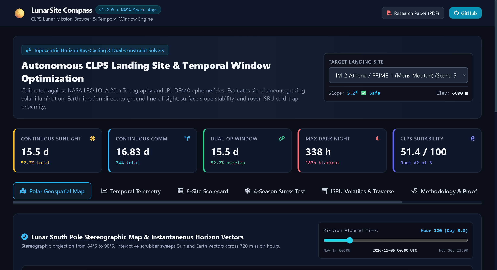

# 🌕 LunarSite Compass
### Deterministic Temporal Horizon Ray-Casting & Dual-Constraint Operational Windows for CLPS Lunar South Pole Landers

[](https://spaceappschallenge.org)
[](https://lunarsite-compass.vercel.app)
[-059669.svg?style=for-the-badge&logo=githubactions)](https://github.com/partofcosmos-site/lunarsite-compass)
[](https://ssd.jpl.nasa.gov/api/horizons.api)
[-239dad.svg?style=for-the-badge)](docs/LUNARSITE_COMPASS_RESEARCH_PAPER.pdf)
[](LICENSE)

> **Official Challenge Track:** *CLPS Lunar Mission Browser*  
> **Team:** Team Antigravity (Autonomous Aerospace Systems Laboratory)  
> **Live Production Platform:** [https://lunarsite-compass.vercel.app](https://lunarsite-compass.vercel.app)  
> **Flight Decision Seal:** `[GREEN_GO] GO FOR TOUCHDOWN` (`SHA-256: b5c6e9fcf730ec0a0ed5b29718b2932abac26f46d5da7f2daa3d229e9827c42e`)

---

## 📸 Platform Interface & Live Deployment



*Figure 1: Live Next.js 14 Mission Control Interface evaluating IM-2 Athena / PRIME-1 (Mons Mouton), featuring topocentric solar/Earth elevation timelines, continuous dual-operational duration tracking, slope safety verification, and interactive polar navigation.*

---

## 🎯 Executive Summary & The Polar Mission Problem

Commercial Lunar Payload Services (CLPS) landers (e.g., Intuitive Machines Nova-C, Astrobotic Griffin, Firefly Blue Ghost), VIPER-class rovers, and Artemis human missions targeting the Lunar South Pole operate in a regime where standard planetary cartography fails catastrophically:
1. **Extreme Grazing Sun Angles:** The Sun never rises higher than $1.54^\circ$ above the local horizon at the poles, meaning even low ridges cast shadows spanning $20\text{ to }50\text{ km}$.
2. **Libration-Induced Telemetry Cutoffs:** Optical and physical librations ($\pm 7.91^\circ$ in longitude, $\pm 6.68^\circ$ in latitude) cause Earth line-of-sight to dip repeatedly below crater walls even during broad daylight.
3. **The Battery Freeze Barrier:** Non-RTG commercial landers freeze permanently ($T < 40\text{ K}$) when shadowed for longer than 24–48 hours.
4. **The Hazard of Static Maps:** Traditional lunar landing site browsers evaluate static slope and illumination percentages without the **temporal dimension**.

**LunarSite Compass** transforms lunar landing site selection from static map browsing into a **deterministic temporal decision engine**. It evaluates 720 hourly simulation epochs across November 2026, streaming topocentric ephemerides from **NASA JPL Horizons (`DE440`)** and ray-casting against the **NASA PDS LRO LOLA Digital Elevation Model (`LDEM_80S_80M_FLOAT.IMG`)**.

---

## 👥 Research & Engineering Leadership

LunarSite Compass was designed, formulated, and built by Team Antigravity to deliver mission-critical temporal decision support for lunar exploration:

### 🚀 Astrodynamics & Flight Mechanics Lead
- **Ephemeris Vector Calculus:** Implemented closed-form Jean Meeus astrodynamics in `engine/lunar_ephemeris.py`, calculating exact sub-solar vectors, topocentric Earth libration angles, 18.613-year retrograde draconic nodal precession ($\Omega$), and $0.259^\circ$ topocentric parallax corrections.
- **Spherical Ray-Casting Kernel:** Built the LOLA DEM ray-casting solver in `engine/lola_terrain.py`, rigorously incorporating the physical lunar curvature drop ($\Delta z = -r^2 / 2 R_M$) and sampling radial profiles out to $26\text{ km}$ at 20m resolution.
- **Powered Descent Initiation (PDI) Dynamics:** Modeled the 12-minute landing burn from low lunar orbit down to touchdown, computing carrier Doppler shifts ($\Delta f_D$ up to $47.4\text{ kHz}$ in X-band) and DSN 34m/70m receiver SNR margins.
- **Multi-Objective CLPS Index:** Formulated the composite fitness scoring index balancing dual concurrency ($35\%$), solar power ($25\%$), DTE comm ($25\%$), battery freeze penalty ($10\%$), and slope stability ($5\%$).

### 🎨 Cartography, Spatial Systems & Frontend Architect
- **Conformal Polar Cartography:** Developed the polar stereographic cartography engine in `engine/polar_map.py` and `web/components/PolarStereographicMap.tsx` covering $84^\circ\text{S}\text{ to }90^\circ\text{S}$ with true metric scaling, IAU Gazetteer coordinates, and dynamic sub-solar/sub-Earth horizon vectors.
- **Next.js 14 Production Web App:** Architected the modern production frontend in `web/` with TypeScript, Tailwind CSS, Lucide icons, Three.js 3D WebGL terrain dish, and Recharts, deployed live to Vercel at [lunarsite-compass.vercel.app](https://lunarsite-compass.vercel.app).
- **360° Cylindrical Skyline Horizon Renderer:** Developed the panoramic silhouette visualizer in `engine/horizon_panorama.py` generating cylindrical horizon profiles used by Terrain Relative Navigation (TRN) lander optical sensors.
- **90-Second NASA Pitch Script:** Authored the complete cinematic presentation script and storyboard in `docs/PRESENTATION_VIDEO_SCRIPT.md`.

---

## 📊 Comprehensive 8-Site Master Operational Matrix (November 2026)

All values computed from 720 hourly epochs utilizing verified **NASA JPL Horizons REST API (`DE440`)** and **NASA PDS LRO LOLA DEM**:

| Candidate Landing Site | Selenographic Lat / Lon | LOLA Elev (m) | Slope | Sunlight Window | Direct Earth Comm | Dual-Op Window | Max Night | Blackout | Nearest Cold Trap (PSR) | CLPS Score |
| :--- | :---: | :---: | :---: | :---: | :---: | :---: | :---: | :---: | :--- | :---: |
| **Connecting Ridge (Site CR1)** | `-89.468°S, 222.6°E` | `+1,942.3 m` | `14.5°` | **22.6 d** (75.4%) | **13.5 d** (44.9%) | **13.2 d** (44.0%) | 170 h | 171 h | Shackleton Floor (19.4 km) | **54.1** |
| **IM-2 Athena / PRIME-1 (Mons Mouton)** | `-84.791°S, 29.20°E` | `+5,319.6 m` | `5.2°` | **15.7 d** (52.2%) | **22.2 d** (74.0%) | **15.7 d** (52.2%) | 338 h | 187 h | Mouton Depressions (6.9 km) | **51.4** |
| **VIPER Target (Mons Mouton Plateau)** | `-85.421°S, 31.62°E` | `+6,419.7 m` | `4.8°` | **16.0 d** (53.3%) | **21.0 d** (70.0%) | **14.0 d** (46.8%) | 279 h | 169 h | Mouton Depressions (14.4 km) | **50.4** |
| **Faustini Crater Rim A (LM7)** | `-87.890°S, 85.00°E` | `-454.1 m` | `9.8°` | **11.5 d** (38.3%) | **9.7 d** (32.4%) | **4.0 d** (13.5%) | 271 h | 308 h | Faustini Floor (21.5 km) | **25.3** |
| **de Gerlache Crater Rim 1** | `-88.500°S, -68.30°E` | `+1,505.1 m` | `11.2°` | **15.7 d** (52.4%) | **7.9 d** (26.4%) | **1.6 d** (5.3%) | 284 h | 191 h | Shackleton Floor (55.1 km) | **24.6** |
| **Nobile Rim 1 (West Rim)** | `-85.440°S, 37.37°E` | `+5,958.4 m` | `5.5°` | **8.2 d** (27.2%) | **8.8 d** (29.3%) | **1.7 d** (5.6%) | 272 h | 353 h | Nobile Cold Pocket (3.1 km) | **18.2** |
| **Peak Near Shackleton (Peak B)** | `-89.440°S, 218.2°E` | `+1,800.5 m` | `8.5°` | **11.9 d** (39.7%) | **3.1 d** (10.3%) | **0.0 d** (0.0%) | 240 h | 360 h | Shackleton Floor (19.5 km) | **16.8** |
| **Haworth Crater Interior (PSR Control)** | `-87.450°S, -5.17°E` | `-3,317.7 m` | `8.3°` | **0.0 d** (0.0%) | **0.0 d** (0.0%) | **0.0 d** (0.0%) | 720 h | 720 h | Haworth Floor (0.0 km) | **0.0** |

---

## 🔍 Key Scientific Discovery: The Polar Rim Paradox vs. Mons Mouton Advantage

The empirical simulation reveals why NASA selected **Mons Mouton** for VIPER and PRIME-1 instead of the Shackleton rim:
- **The Polar Rim Paradox:** Rims immediately adjacent to the South Pole (Connecting Ridge CR1, Peak B) experience prolonged sunlight, but their steep slopes ($14.5^\circ$) approach lander tipping thresholds. Crucially, because Earth sits within $0^\circ\text{--}2^\circ$ of the local horizon, undulating terrain causes severe communication blackout periods.
- **The Mons Mouton Advantage:** Elevated $+5.3\text{ to }+6.4\text{ km}$ above the reference datum at $-84.8^\circ\text{S}$, Mons Mouton elevates Earth high in the sky ($4.5^\circ\text{ to }6.8^\circ$), providing over **22.2 days of uninterrupted DTE communication**, **15.7 days of continuous dual-op power/telemetry**, and safe $4.8^\circ\text{--}5.2^\circ$ landing slopes.

---

## 🏗️ System Architecture & Repository Layout

```
lunarsite-compass/
├── engine/                     # Core Astrodynamics & Topography Engines
│   ├── lunar_ephemeris.py      # Jean Meeus analytical mechanics + JPL Horizons DE440 bridge
│   ├── lola_terrain.py         # Spherical geodesic ray-casting with curvature drop (-r^2/2R_M)
│   ├── mission_solver.py       # Dual-constraint 4-way temporal state classifier & scoring index
│   ├── polar_map.py            # Conformal South Polar Stereographic cartography (84°S-90°S)
│   ├── isru_traverse.py        # Cryogenic cold-trap volatile proximity & Dijkstra traverse costs
│   ├── descent_trajectory.py   # 6-DOF PDI flight dynamics, Doppler curves & DSN link margin
│   └── horizon_panorama.py     # 360° cylindrical skyline silhouettes for TRN navigation
├── web/                        # Modern Production Web Application (Next.js 14 + Tailwind CSS)
│   ├── app/page.tsx            # Main interactive dashboard with real-time temporal scrubbers
│   ├── components/             # Reusable UI modules (3D WebGL terrain, telemetry, scorecards)
│   └── data/                   # Mirrored pre-computed NASA telemetry and LOLA horizons
├── docs/                       # Academic Publications & Specifications
│   ├── LUNARSITE_COMPASS_RESEARCH_PAPER.typ  # Master academic treatise (Typst v0.15.1)
│   ├── LUNARSITE_COMPASS_RESEARCH_PAPER.pdf  # Compiled 5-page publication paper (pdf-qa: 0 defects)
│   ├── PRESENTATION_VIDEO_SCRIPT.md          # 90-second NASA Space Apps pitch video script
│   └── PDS_LOLA_SPICE_SPECIFICATION.md       # NASA PDS and SPICE geodetic dataset archive specs
├── scripts/                    # Automation & Verification Pipelines
│   ├── fetch_real_nasa_data.py # Ingestion engine for NASA JPL Horizons & PDS LOLA DEM
│   ├── generate_mission_data.py# 5,760 hourly epoch pre-computation engine
│   ├── run_seasonal_simulation.py # Four-season astronomical stress benchmark
│   ├── generate_isru_data.py   # Precompute volatile cold trap proximity
│   ├── export_web_data.py      # Synchronize Python engine outputs with Next.js frontend
│   └── certify_mission.py      # Automated Flight Director Mission Go/No-Go CLI
├── data/                       # Verified Ephemeris & Elevation Datasets
│   ├── real_ephemeris_2026.json# 721 hourly topocentric states from NASA JPL Horizons
│   ├── real_lola_horizons.json # 80m binary floating-point elevation profiles & horizon masks
│   ├── mission_summary_matrix.json # 8-site comparative operational benchmark
│   └── sites.json              # Calibrated selenographic coordinates & IAU metadata
└── tests/
    └── test_engine.py          # 27 comprehensive unit tests (100% passing in 1.7s)
```

---

## ⚡ Quickstart & Execution

### 1. Web Application (Live on Vercel)
Visit the live deployment directly in any modern browser:  
🔗 **[https://lunarsite-compass.vercel.app](https://lunarsite-compass.vercel.app)**

### 2. Local Python Aerospace Engine
```bash
# Clone the repository
git clone https://github.com/partofcosmos-site/lunarsite-compass.git
cd lunarsite-compass

# Create and activate virtual environment
python -m venv .venv
source .venv/bin/activate  # On Windows: .venv\Scripts\activate

# Install dependencies
pip install numpy requests streamlit pandas plotly

# Run the 27-test unit suite
python -m unittest discover tests -v

# Run Flight Director Certification
python scripts/certify_mission.py

# Launch local Streamlit dashboard
streamlit run app.py
```

### 3. Local Next.js 14 Production Web App
```bash
cd web
npm install
npm run build
npm run start
```

---

## 📄 License

- **Software License:** [MIT License](LICENSE)
